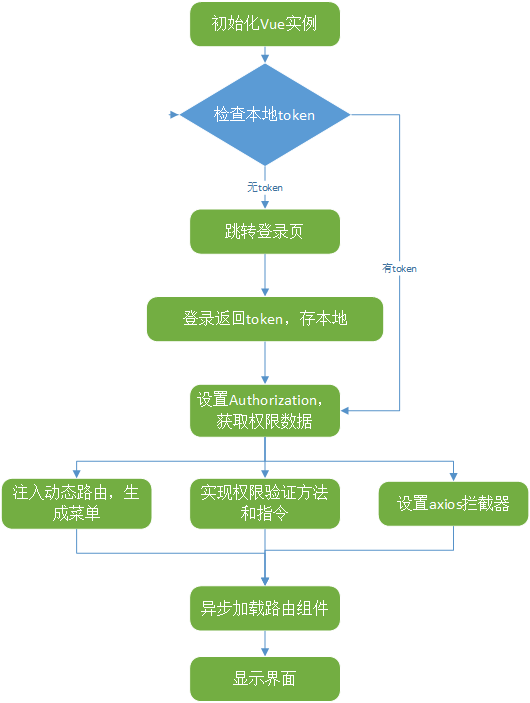

# VPC

> Vue permission Control

## 项目描述
> 基于 vue 开发的一套统一登录 前端用户权限管理的后台系统 

## 构建

``` bash
# install node+git please

# install dependencies
$ npm install / cnpm install

# serve with hot reload at localhost:8060
$ npm run dev

# build for production with minification
$ npm run build

```
## 项目分析
> 基本思路
#### 构思
前端做权限控制，无非后台传数据 前端做判断 我看了大多数项目 都有角色的概念 前端在router.beforEach 导航守卫做文章    
但当我站在巨人肩旁眺望远方的时 总结觉得 前端与业务逻辑是需要解耦的 角色的概念都是人为提出的 其实前端只看数据    
那把权限就抽出来 就是数组 不同的身份角色 给前端不同的数组 再与本地 所有的路由做匹配 返回一个菜单 给用户展示  
  
#### 骨架
vue-cli 初始化项目后 基于模块化 骨架组件构成：Login + Home Header Sidebar Home  业务内容放入 Hoem content内即可  

#### 登录   
VPC适用于多项目统一登录 在Login页面 登录成功 返回的有效token 在进行第二步操作 获取用户数据, 数据保存在vuex内    
考虑到刷新问题 因此 获取用户数据 就必须放在根组件 App.vue 内, 因为Vue是单向流思想 Login 作为App的子组件 需要在Login 登录成功后$emit 到App 执行callback 获取用户数据     

#### 接口mock
上面说到数据 本项目采用 easy-mock mock数据 后端数据规定采用RestFul协议 mock了多种不同身份用户 登录成功返回200，token失效 401 登录成功 返回 token 通过 flyio 在header 添加token 切记这是第一次在Login页 添加 以后每次接口调用 都需 添加token 可在 flyio 拦截器里做


#### 用户数据操作
返回权限数组 在App页面 通过递归 fullPath 本地所有路由 操作 获取用户有效路由 保存在 Vuex内

#### 页面展示
在Sidebar for循环 vuex存储的有效路由并展示  Home组件展示路由具体内容  

#### token失效
flyio 全局拦截响应 只要失效用户访问页面调用接口 失效状态码返回401 就跳转回login页面  
```js
if (err.response.status === 401) {
    window.location.href = '/login';
  } 
```

    
## 设计构图



## 结构
```
│          
├─build
│      build.js
│      check-versions.js
│      utils.js
│      vue-loader.conf.js
│      webpack.base.conf.js
│      webpack.dev.conf.js
│      webpack.prod.conf.js
│      
├─config
│      dev.env.js
│      index.js
│      prod.env.js
│      
├─src
│  │  404.vue
│  │  App.vue                                // 根组件
│  │  bus.js                                 // EventBus 适用于兄弟组件 通信
│  │  dave.js                                // canvas 效果
│  │  globar.js                              // webpack 全局注册ui组件
│  │  main.js                                // 项目入口
│  │  tools.js                               // 插件
│  │  
│  ├─api                            
│  │      axios.js
│  │      common.js                          // 基本接口
│  │      request.js                         // flyio 拦截器
│  │      weather.js                         // 天气接口
│  │      
│  ├─assets                                  
│  │  │  logo.png 
│  │  │   
│  │  └─theme-dave                            // 自定义主题
│  │              
│  ├─components                               // 主要组件
│  │  ├─common
│  │  │      Header.vue
│  │  │      Home.vue
│  │  │      Login.vue
│  │  │      SideBar.vue
│  │  │      
│  │  ├─render                                 // render 渲染组件 适用多条件渲染
│  │  │      btn-render.vue
│  │  │      
│  │  ├─ui
│  │  │      baseButton.vue                    // 基于element-ui btn ui组件 可层叠复用
│  │  │      
│  │  └─view
│  │          403.vue
│  │          404.vue
│  │          allocation.vue
│  │          render.vue
│  │          watch.vue
│  │          
│  ├─router                                    // 本地所有路由
│  │      fullPath.js
│  │      index.js                             // 基本路由
│  │      
│  └─store                                     // 状态管理 全局变量
│          actions.js
│          getters.js
│          index.js
│          mutations.js
│          state.js
│          
│  .babelrc
│  .editorconfig
│  .eslintignore
│  .eslintrc.js                                 // 基于airbnb-base 个人配置的代码规则
│  .gitignore
│  .postcssrc.js
│  index.html
│  package-lock.json
│  package.json
│  README.md
            
```


## 技术分析
> Vue组件通信 使用分析  


1.Vuex：状态管理模式,集中式存储管理应用的所有组件的状态，并以相应的规则保证状态以一种可预测的方式发生变化  
2.EventBus: 非父子组件的通信 使用事件中心，允许组件自由交流  
案列重现：  
当我比如在该项目中Header组件里改变一个变量属性值 并要求在SideBar 和 Home组件里 响应其变化时候如何做？    
3.分析：  
Vuex 顾名思义就是管理全局变量，这里是管理 而不是只读 是可读，可更改 可检测的，Vue是单向流 首先介绍一下ECMAScript俩种属性：    
数据属性和访问器属性，前者: [Configurable]，[[Enumerable],[Writable],[Value] 可配置 可枚举 可复写 value  
通常对象字面量创建 对象 var person = { name: "dave" } 就是数据属性 改变和读取的 只是 对象的 value  
而后者 访问器属性 [Configurable]]，[[Enumerable]],[[Get]],[[Set]，在JavaScript中我们使用Object.defineProperty来定义访问器属性  
在Vue里 获取 this.person 就是调用 get方法  设置就是 set方法。 Vue有自己的的 data tree 正是通过访问器属性才实现 依赖追踪 watch的  
除此 Vuex EventBus 之外 Vue.prototype.xx 以及 this.$root  和 本地存储 localStorage 操作组件变量都不具备watch功能  

4.总结：    
Vue.prototype.xx，this.$root 只是可读取的 和更改的 在Vue的原型上修改读取 但并不能watch, Vue.prototype.xx 可以写全局变量 用来做 校验证 默认值 等操作  
localStorage 也是。它可以读取设置 有人说可以用addEventListener 监听storage 但是并不期望在Vue层这么做,本项目 token 就是用 本地存储    
综上所属  此案例就可以用到vuex  我们需要变量可预测 接着执行callback    
如果你觉得麻烦 就用EventBus 兄弟组件通信,$emit 触发 $on监听回调 即可  


## 事后一根烟
本项目构建 重点不是需要丰富的后台组件 而是权限路由控制思想 只是搭建骨架  
给自己工作上做一总结 后期会多加封装组件化进项目之中，使"项目"更加充实健壮
